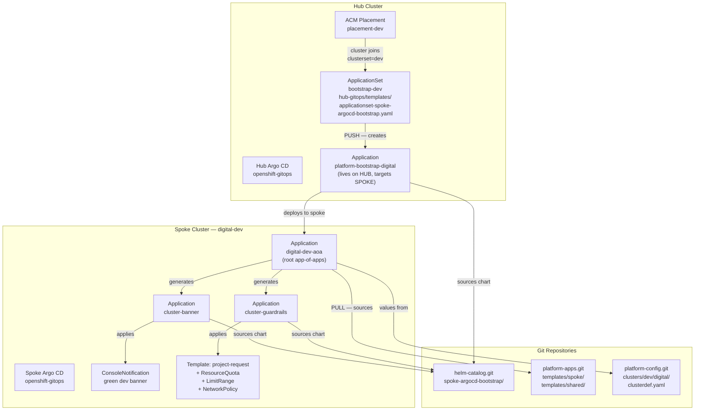
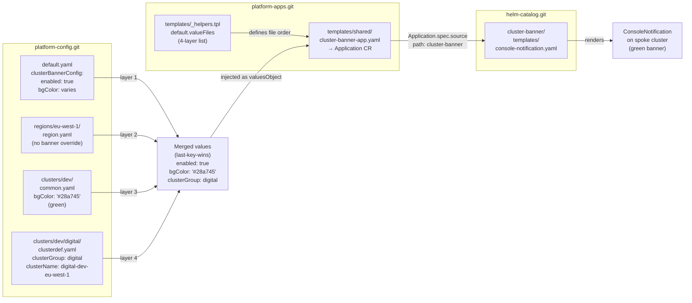
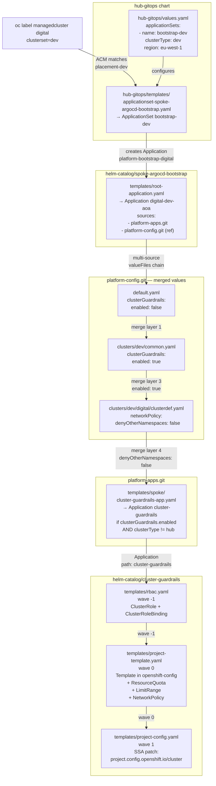
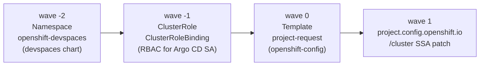

# Architecture Diagrams

Reference diagrams for the two-tier hub-spoke GitOps platform.
See [RUNBOOK.md](RUNBOOK.md) for operational procedures and [README.md](README.md) for chart reference.

---

## Diagram 1 — The two-tier push/pull model

The hub **pushes** a bootstrap Application to each spoke via ACM and ApplicationSets.
The spoke's own Argo CD then **pulls** all further configuration independently.



---

## Diagram 2 — Config merge chain → how values reach a chart

Four YAML layers are merged (last-key-wins) before being passed as Helm values to a chart.
This example traces how the cluster-banner colour and enabled flag flow to the spoke.



---

## Diagram 3 — Detailed file references: cluster-guardrails end-to-end

Traces every file touched from the ACM `oc label` command to the on-cluster resources,
using cluster-guardrails as the example.



---

## Diagram 4 — Sync wave ordering within a spoke Application

Argo CD applies resources in ascending wave order within a single Application sync.
This example shows the cluster-guardrails wave sequence.



---

## Key concepts

**Push model (hub → spoke)**
The hub cluster is the only entity that writes to spokes at bootstrap time.
ACM Placement selects clusters; the ApplicationSet fans out one bootstrap Application per matched cluster.
The platform team controls which clusters are bootstrapped by managing `oc label managedcluster`.

**Pull model (spoke → Git)**
After bootstrap, each spoke's Argo CD polls Git directly.
The hub plays no further role in managing spoke application state.
This means a spoke continues to function correctly even if the hub is unavailable.

**Four-layer config merge**
```
default.yaml  →  regions/<r>/region.yaml  →  clusters/<type>/common.yaml  →  clusters/<type>/<group>/clusterdef.yaml
```
Each later layer overrides earlier keys. A feature is toggled on at the environment layer (`common.yaml`)
and tuned or disabled at the cluster layer (`clusterdef.yaml`).

**clusterGroup convention**
The `ManagedCluster` name in ACM is used as `clusterGroup`. This is also the folder name under
`clusters/<type>/` in `platform-config`. Convention: one folder = one cluster.
